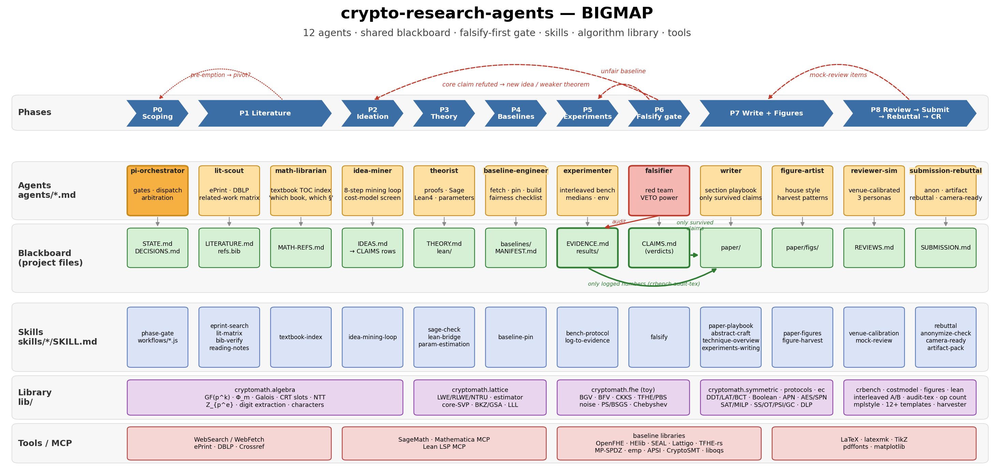
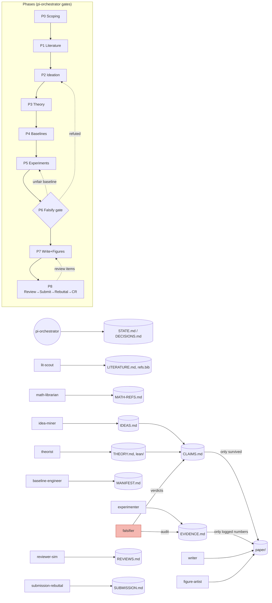

# BIGMAP — the whole system on one page

*(Regenerate: `python3 docs/bigmap/make_bigmap.py` → `bigmap.{png,svg,pdf}`.)*

## 1. Six layers

| Layer | What lives there | Where |
|---|---|---|
| **Phases** | P0 Scoping → P1 Literature → P2 Ideation → P3 Theory → P4 Baselines → P5 Experiments → P6 Falsify gate → P7 Writing+Figures → P8 Review/Submit/Rebuttal/Camera-ready | `workflows/PHASES.md` |
| **Agents** | 12 role-specialised subagents; one owner per phase | `agents/*.md` |
| **Blackboard** | Plain Markdown files inside *your* research project; the only channel agents use to hand off work | `templates/blackboard/` |
| **Skills** | Step-by-step procedures + scripts an agent loads on demand | `skills/*/SKILL.md` |
| **Library** | Python algorithm library (algebra, lattice, FHE, symmetric, protocols, EC, cost models), benchmarking harness, figure kit, Lean template | `lib/`, `figures/` |
| **Tools** | Web (ePrint/DBLP/Crossref), SageMath, Mathematica MCP, Lean LSP MCP, baseline libraries, LaTeX | `references/baselines/MANIFEST.md` |

## 2. The three invariants that make the agents trustworthy

1. **Falsify first.** An idea becomes a *claim* only when it is written into `CLAIMS.md` as a
   precise, falsifiable statement. The `falsifier` attacks it (definitions → numerics →
   baseline fairness → literature pre-emption) *before* anyone writes prose about it.
   Only `survived` (or `weakened`, with the weaker wording) claims can enter `paper/`.
2. **Every number has a log.** No number enters the paper without an `EVIDENCE.md` row
   (command, log path, commit, machine, repeats, statistic). `crbench audit-tex` enforces it.
3. **Every reference exists.** `bib-verify` checks each bib entry against DBLP/Crossref/ePrint;
   unverifiable entries are removed, never "fixed from memory".

## 3. Interaction flow

## 4. Who talks to whom (hand-off contracts)

| From → To | Artifact | "Done" means |
|---|---|---|
| PI → any | task row in `STATE.md` | input files, expected output file, deadline stated |
| lit-scout → idea-miner | `LITERATURE.md` matrix | ≥ 15 verified works, strongest baseline named, pre-emption scan dated |
| math-librarian → theorist | `MATH-REFS.md` rows | each needed fact has book + chapter/theorem number |
| idea-miner → falsifier | `CLAIMS.md` rows (status `open`) | claim is quantified, parameter range given, kill criterion stated |
| theorist → falsifier | `THEORY.md` + scripts | every lemma checked numerically on small params; Lean status recorded |
| baseline-engineer → experimenter | `MANIFEST.md` | builds at pinned commit; published numbers reproduced or discrepancy documented |
| experimenter → falsifier / writer | `EVIDENCE.md` + tables | interleaved, ≥ 3 repeats, medians, env captured |
| falsifier → PI | verdict column | every open claim decided; refutations have a reproducible script |
| writer / figure-artist → reviewer-sim | `paper/main.pdf` | audit-tex clean, 0 undefined refs, figures in house style |
| reviewer-sim → PI | `REVIEWS.md` action items | each item routed to an agent |
| submission-rebuttal → human | `SUBMISSION.md` | checklist green; anonymisation clean; human approves before anything leaves the machine |

## 5. Scope of the library (not only FHE)

| Area | Modules | Typical experiment |
|---|---|---|
| Algebra / number theory | `cryptomath.algebra` | slot structure of a cyclotomic ring, Galois orbits, digit-extraction degree |
| Lattices | `cryptomath.lattice` | security estimate of (n, q, σ), BKZ block size vs. δ, toy LLL attack |
| FHE | `cryptomath.fhe` | noise growth of BGV/BFV/CKKS/TFHE ops, PBS with arbitrary LUT, PS/BSGS counts |
| Symmetric | `cryptomath.symmetric` | S-box DDT/LAT/BCT, APN checks, SAT/MILP trail models, toy SPN/AES, FHE-friendly cipher cost |
| Protocols / MPC / PSI | `cryptomath.protocols` | Shamir/Beaver, OT, OPRF, PSI and GC communication models |
| Elliptic curves | `cryptomath.ec` | toy curve arithmetic, BSGS / Pollard-rho DLP |
| Cost screening | `cryptomath.costmodel` | count ops of two algorithms before implementing either |
| Benchmarking | `crbench` | fair interleaved A/B on any binary, EVIDENCE ledger, LaTeX tables |
| Figures | `figures/` | 12+ publication templates, harvester for learning figure patterns from local PDFs |
